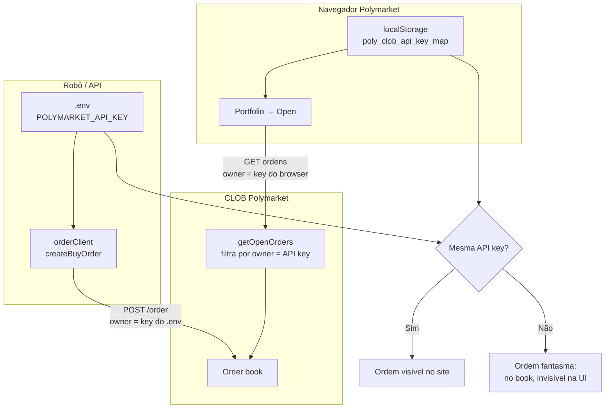

# Ordens abertas na Polymarket: UI vs API e o papel das API keys L2

**Data do achado:** julho/2026  
**Contexto:** `polymarket-robot` / preparação do `data-robot`  
**Sintoma relatado:** ordens enviadas pelo robô eram aceitas pelo CLOB (`status: live`), podiam ser executadas, mas **não apareciam** na aba **Open** do Portfolio nem na tela do evento no site — só ficavam visíveis depois de executadas (History/Positions).

---

## Resumo executivo

O problema **não era** identidade de carteira errada (`funder` / `signatureType` estavam corretos). O problema era usar uma **API key L2 diferente** da que o site Polymarket usa no navegador.

No CLOB, cada ordem carrega um campo `owner` = UUID da **API key** que a enviou. O site lista ordens abertas **apenas para a API key da sessão web** (armazenada em `localStorage` como `poly_clob_api_key_map`). Ordens enviadas com outra key existem no book e podem executar, mas **ficam invisíveis na UI**.

**Correção:** alinhar o `.env` do robô à chave **derivada** (nonce 0), a mesma que o navegador obtém no login — **não** criar uma chave separada com `--create` se a meta é ver ordens no site.

---

## Como a Polymarket organiza identidade e ordens

### Três camadas distintas

| Camada | O que é | Exemplo no nosso caso |
|--------|---------|------------------------|
| **Signer (EOA)** | Carteira que assina EIP-712 (`POLYMARKET_PRIVATE_KEY`) | `0x5324...4CbB` |
| **Maker / Funder** | Endereço do perfil que “possui” saldo e ordens on-chain | `0x6dd3...eeda2` (proxy Magic/email) |
| **Owner (API key)** | UUID da credencial L2 que **submeteu** a ordem ao CLOB | `876a2049-...` (site) vs `a5456276-...` (robô antigo) |

### Tipos de assinatura (`POLYMARKET_SIGNATURE_TYPE`)

| Valor | Nome | Quando usar |
|-------|------|-------------|
| `0` | EOA | Carteira direta (novas contas costumam não funcionar para trading) |
| `1` | POLY_PROXY | Login email / Magic Link (**nosso caso**) |
| `2` | POLY_GNOSIS_SAFE | Safe deployado pelo navegador |
| `3` | POLY_1271 | Deposit wallet V2 (contas migradas pós-abr/2026) |

O **funder** deve ser o endereço exibido em [polymarket.com/settings](https://polymarket.com/settings) (proxy do perfil), **não** o EOA signer.

### APIs envolvidas

- **CLOB** (`clob.polymarket.com`) — envio, cancelamento, `getOpenOrders`, saldo pUSD
- **Gamma** (`gamma-api.polymarket.com`) — perfil público, `proxyWallet`
- **Data** (`data-api.polymarket.com`) — posições, atividade (fills aparecem aqui independente da API key)

Documentação: [Introduction](https://docs.polymarket.com/api-reference/introduction)

---

## O achado em detalhe

### Sintomas observados

1. Robô logava `✅ BUY ordem aceita | status=live`
2. `getOpenOrders()` via **mesma** credencial do `.env` listava a ordem
3. `maker_address` da ordem = funder correto (`0x6dd3...`)
4. Site: **“No open orders found”** na aba Open
5. Após fill: posição/trade visível em History ou Positions

### Experimento que provou a causa

Com uma ordem `LIVE` aberta, comparamos `getOpenOrders()` com duas credenciais L2 da **mesma** chave privada:

| Credencial | Prefixo da API key | Vê a ordem? | `getOrder(id)` |
|------------|-------------------|-------------|----------------|
| `.env` antigo (`--create`) | `a5456276` | **Sim** | status `LIVE` |
| Derivada (nonce 0, usada pelo site) | `876a2049` | **Não** | `null` |

O site guarda no `localStorage`:

```text
poly_clob_api_key_map → {
  "0x6dd3...eeda2": {
    "key": "876a2049-...",
    "baseAddress": "0x5324...4CbB",
    ...
  }
}
```

O robô usava `a5456276-...` — outro `owner` no CLOB. Mesma conta on-chain, **dois canais L2**.

### Depois da correção

1. Rodamos `npm run derive-key -- --write-env --safe --derive-only` no `polymarket-robot`
2. `.env` passou a usar `876a2049...` (mesma key do navegador)
3. Nova ordem `LIVE` → aba **Open** do Portfolio mostrou:
   - *Bitcoin Up or Down - July 5, 1:55AM-2:00AM ET*
   - Buy Up 1¢ · 0/5 · $0.05 · Until cancelled
   - Botão **Cancel all**

---

## Diagrama do fluxo



---

## Como fazer corretamente no futuro

### 1. Configurar credenciais L2 (regra de ouro)

**Use a chave derivada, não uma chave criada à parte.**

```bash
cd data-robot   # ou polymarket-robot, quando migrado

# Deriva a mesma key que o site usa (nonce 0) e grava no .env
npm run derive-key:write
```

| Comando | Quando usar |
|---------|-------------|
| `derive-key --write-env --safe --derive-only` | **Padrão** — alinhar robô ao site |
| `derive-key` (sem `--create`) | Só imprimir credenciais para conferência |
| `derive-key --create` | **Evitar** se quiser ver ordens no site |
| `derive-key:rotate-new` / `rotate-new-force` | Só rotação deliberada; quebra visibilidade na UI até realinhar |

### 2. Configurar identidade on-chain

No `.env`:

```env
POLYMARKET_PRIVATE_KEY=0x...          # EOA exportada (Magic/email)
POLYMARKET_SIGNATURE_TYPE=1           # POLY_PROXY para login email
POLYMARKET_FUNDER_ADDRESS=0x...       # proxyWallet do perfil (settings)
```

Validação rápida:

- Gamma: `GET https://gamma-api.polymarket.com/public-profile?address=<FUNDER>`
  - `proxyWallet` deve igualar `POLYMARKET_FUNDER_ADDRESS`
- Data API: posições em `/positions?user=<FUNDER>` — não no signer EOA

### 3. Antes de operar em produção

Checklist mínimo:

- [ ] `POLYMARKET_API_KEY` prefixo = key em `poly_clob_api_key_map` do browser (primeiros 8 chars)
- [ ] Saldo pUSD > 0 via `getBalanceAllowance` com config atual
- [ ] `POLYMARKET_FUNDER_ADDRESS` = `proxyWallet` do perfil
- [ ] Teste: enviar ordem pequena `postOnly` → conferir aba **Open** no site (F5 se necessário)

Script de referência no `polymarket-robot`:

```bash
npm run test:dual-orders -- --up-only --price 0.01 --size 5
# Sem --cancel: deixa aberta para inspecionar no site
```

### 4. Depois de enviar ordem pela API

- A UI **pode** precisar de refresh (`F5`) ou re-clicar na aba **Open** (às vezes a URL é `?tab=open` mas a UI abre em Positions).
- Ordens **marketable** em BTC 5m passam por delay de ~250 ms ([order lifecycle](https://docs.polymarket.com/concepts/order-lifecycle)); status pode ser `delayed` antes de `live`.
- Ordens **matched** imediato não aparecem em Open — só em History.

### 5. O que o robô deve usar para monitorar

| Fonte | Uso |
|-------|-----|
| `getOpenOrders()` | Ordens abertas **desta** API key |
| `getOrder(id)` | Status, `maker_address`, `size_matched` |
| `getTrades()` | Execuções |
| Data API `/positions` | Posições agregadas por funder (como o site em Positions) |
| Site Open | Conferência humana — mesma key L2 obrigatória |

**Não confiar só no site** para automação; **não confiar só no site** para validar se a key está certa.

---

## Causas que NÃO eram o problema (mas confundem)

| Hipótese | Veredito no nosso caso |
|----------|------------------------|
| Funder errado | ❌ `maker_address` = funder correto |
| `signatureType` errado | ❌ `1` + saldo $28 pUSD OK; EOA/1271/Safe davam $0 |
| Ordem não está no book | ❌ `status: live`, bid em $0.01 no book público |
| Conta deposit wallet V2 | ❌ funder é EOA; não precisa `signatureType=3` |
| 2FA | ❌ irrelevante para CLOB API (só afeta login web) |

---

## Diagnóstico quando “ordem sumiu” de novo

### Passo 1 — API enxerga?

```bash
npm run check:api-key
```

### Passo 2 — Key do robô = key do site?

No DevTools do navegador (Application → Local Storage → `poly_clob_api_key_map`), compare o prefixo de `key` com `POLYMARKET_API_KEY` no `.env`.

Ou via `polymarket-web-api`:

```bash
cd polymarket-web-api
npm start
# Após login manual:
curl http://127.0.0.1:3010/api/account/wallet
```

### Passo 3 — Comparar duas keys programaticamente

Derivar nonce 0 e comparar com `.env`:

```bash
npm run derive-key -- --derive-only --safe
```

Se o prefixo impresso ≠ prefixo no `.env` → **realinhar** com `--write-env --safe --derive-only`.

### Passo 4 — UI ainda vazia mas API OK?

- Refresh / reabrir aba Open
- Ordem já foi `matched` ou cancelada
- Evento BTC 5m encerrou (mercado fechado)
- Valor muito baixo: ordem existe ($0.05) — no teste apareceu normalmente

---

## Impacto no desenvolvimento do data-robot

Ao migrar código do `polymarket-robot`:

1. **Documentar** no onboarding que L2 derivada ≠ L2 `--create`
2. **Startup check** (futuro): comparar prefixo da API key com perfil esperado; alertar se `deriveApiKey(0).key !== POLYMARKET_API_KEY`
3. **Testes de conexão** devem incluir:
   - auth L2 + saldo
   - `maker_address` = funder
   - opcional: cross-check com `polymarket-web-api` em ambiente de dev
4. **Nunca** logar secret/passphrase; `poly_clob_api_key_map` e `.env` fora do git

---

## Comandos úteis (data-robot)

```bash
# Credenciais corretas (alinhar ao site)
npm run derive-key:write

# Validar alinhamento API key
npm run check:api-key

# Teste de ordem real (cuidado: dinheiro real)
npm run test:order -- --wait 15
npm run test:order -- --wait 15 --cancel
```

---

## Histórico desta investigação

| Etapa | Resultado |
|-------|-----------|
| Diagnóstico identidade funder/signer | OK — proxy `0x6dd3...`, signer `0x5324...`, type `1` |
| `getOpenOrders` com key `a5456276` | Via ordens do robô |
| `getOpenOrders` com key `876a2049` | Não via ordens do robô |
| `derive-key --write-env --safe --derive-only` | `.env` alinhado ao browser |
| Ordem teste + browser logado | Visível na aba Open do Portfolio |

---

## Referências

- [Get user orders (CLOB)](https://docs.polymarket.com/api-reference/trade/get-user-orders) — ordens filtradas por credencial autenticada
- [Order lifecycle](https://docs.polymarket.com/concepts/order-lifecycle) — `live`, `delayed`, `matched`
- [Clients & SDKs](https://docs.polymarket.com/api-reference/clients-sdks) — `@polymarket/clob-client-v2`
- Ecossistema GoldenLens: `polymarket-web-api/README.md` — sessão browser para diagnóstico
