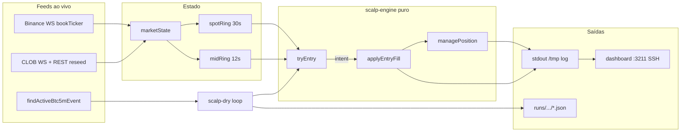

# Handoff: simulação dry — Binance-lead scalp

Documento técnico autossuficiente para outra IA (ou humano) entender **como funciona o dry/shadow** do scalp lead-lag Binance → Polymarket BTC Up/Down 5m, sem depender do histórico de chat.

**Repo:** `data-robot` (Node 22 ESM) · **produção ops:** Coolify Giovanna · container sidecar `pair-path-micro`  
**Lab estatístico (espelho):** `data-backtest/labs/sandbox/binance-lead-scalp/`

---

## 1. Objetivo e não-objetivos

### Objetivo

Rodar a **mesma lógica de decisão** do lab GO (variant E / E-freq) contra **feeds ao vivo**:

- Spot BTC: **Binance WebSocket** (`btcusdt@bookTicker`)
- Book Polymarket: **CLOB WebSocket** (+ REST reseed se lag)
- Evento: mercado ativo **BTC Up/Down 5m** via Gamma/API (`findActiveBtc5mEvent`)

Tudo em modo **dry/shadow**: calcula intents, simula fills, registra PnL paper — **nunca envia ordem** ao CLOB.

Valida sobretudo:

- Plumbing (WS conectados, reconexão, book/spot frescos)
- Latência de decisão (`decisionLatencyP95MaxMs`)
- Comportamento em regime real (frequência de impulsos, skips)

### Não-objetivos

- **Não** é backtest estatístico. EV / PF / feeDrag confiáveis vêm do **lab lake** (Parquet + Binance Vision 1s).
- **Não** opera dinheiro. `--live` é **recusado** em `scalp-dry.js`.
- **Não** substitui holdout ou paper com fill real (API de execução).
- Engine `:3201` / UI `:3200` do data-robot **não** são este harness; o dry é script sidecar.

---

## 2. Mapa de arquivos

| Path | Papel |
|---|---|
| `scripts/binance-lead-scalp/scalp-dry.js` | Orquestração I/O: args, feeds, loop por evento, logs, reports JSON |
| `scripts/binance-lead-scalp/scalp-engine.js` | Lógica **pura** (sem I/O): rings, `tryEntry`, `applyEntryFill`, `managePosition`, fees, summarize |
| `scripts/binance-lead-scalp/scalp-dashboard.js` | Painel local HTTP `127.0.0.1:3211` — SSH read-only na Giovanna, parseia log remoto |
| `scripts/binance-lead-scalp/README.md` | Ops curtas / flags |
| `src/feeds/marketState.js` | Estado compartilhado em memória (spot + books UP/DOWN) |
| `src/feeds/binanceSpotFeed.js` | WS Binance → `state.binance`, `binanceReceivedAt`, watchdog stale |
| `src/feeds/clobFeed.js` | WS CLOB depth + subscribe tokens + `lagMs()` / `refreshBooks()` |
| `src/markets/btc5m.js` | `findActiveBtc5mEvent()` → slug, tokenIds, start/end |
| `data-backtest/.../run-scalp-lab.mjs` | Lab histórico espelhando as mesmas regras de entrada/saída |
| `data-backtest/.../boot-dry.sh`, `start-e-freq-bg.sh`, `redeploy-e-freq.sh` | Boot/redeploy no container |

**npm scripts** (`package.json`):

- `npm run scalp-e:dry` → `node scripts/binance-lead-scalp/scalp-dry.js --variant=e-freq`
- `npm run scalp-e:dashboard` → painel :3211

**Artefatos em runtime (container):**

- Log típico e-freq: `/tmp/scalp-e-freq-dry.log`
- Reports: `/usr/src/app/runs/binance-lead-scalp-dry/*.json` (+ summary no fim do run)

---

## 3. Arquitetura e loop



### Ciclo por evento (`runOneEvent`)

1. Resolve evento BTC 5m ativo; se `tau < minTauStart` (default 60s), skip e espera próxima janela.
2. `clobFeed.subscribe(upTokenId, downTokenId)` + `refreshBooks` até book fresco (`lag < maxBookAgeMs`).
3. `createEventState(params)` — estado por evento (posição, trades, blockCounts).
4. Loop a cada `pollMs` (default **50ms**) até fim do evento / deadline:
   - Empurra spot → `spotRing`; mids UP/DOWN → `midRing`.
   - Se book stale: conta `staleBlocks`, tenta refresh, **não** decide.
   - Se há posição: só `managePosition` (não abre outra).
   - Se fill pending (modo cruel): após `cruelLatencyMs`, `applyEntryFill` com ask atual.
   - Senão, se `tau ∈ [minTau, maxTau]`: `tryEntry` → fill imediato (honest) ou agenda pending (cruel).
5. No fim: `forceCloseEod` se ainda aberto; grava report JSON; agrega summary multi-evento.

Heartbeat a cada ~5s no log:

```text
… hb tau=… up=ask/bid dn=ask/bid bn=… trades=… pnl=… open=… bookLag=… spotAge=… fresh=… skip=NO_IMPULSE
```

`skip=` = último `lastNoEntryReason` do engine (não necessariamente o único motivo no segundo).

---

## 4. Variantes de parâmetros

Definidas em `scalp-engine.js`:

### `VARIANT_E` (baseline lab GO)

| Param | Valor |
|---|---|
| `id` | `binance-lead-scalp-e` |
| `leadSec` | 2 |
| `impulseUsd` | **12** (fixo; `impulseVolMult=0`) |
| `staleMidMoveMax` | **0.02** |
| `minAsk` / `maxAsk` | 0.15 / 0.70 |
| `maxSpread` | 0.04 |
| `budget` | 10 |
| `stopLoss` | 0.05 (absoluto em preço do token) |
| `timeoutSec` | 20 |
| `cooldownSec` | 3 |
| `maxTradesPerEvent` | 5 |
| `minTau` / `maxTau` | 20 / 280 |
| `feeRate` | 0.07 |
| `ladderOffsets` | **[0.08, 0.14]** |
| `maxSpotAgeMs` | 2000 |
| `maxBookAgeMs` | 2500 |
| `cruelMakerExtra` | 0.01 |

### `VARIANT_E_FREQ`

Igual a E, exceto limiar **fixo** `$8` e `staleMidMoveMax` **0.03**.

### `VARIANT_E_ADAPT` (default dry)

Igual a E-freq na saída/stale, mas com impulso **adaptativo** e **modo resgate**:

- `impulseVolMult=2.5`, `impulseFloor=5`, `impulseCap=12`, `volWindowSec=300`
- `thr = clamp(2.5 × σ(Δ2s na janela 5min), $5, $12)`; se &lt;30 samples → fallback `impulseUsd=8`
- Função: `impulseThreshold(spotRing, nowMs, cfg)`; ring precisa `spotRingSecsFor(cfg)` (~332s)
- `rescue=true`, `rescueOffset=0.01`, `rescueStop=0` (segura até EOD)

CLI: `--variant=e|e-freq|e-adapt` (default **e-adapt**). Overrides: `--impulse-usd`, `--stale-mid`, `--impulse-vol-mult`, `--impulse-floor`, `--impulse-cap`, `--vol-window`, `--rescue`/`--no-rescue`, `--rescue-offset`, `--rescue-stop`, `--budget`.

**Ideia econômica:** impulso Binance atípico **para o regime atual** (não um $ fixo) → comprar o lado no **ask** (taker) antes do mid Poly reagir demais; realizar com asks maker (+8¢ / +14¢); stop/timeout no bid.

---

## 5. Regras de entrada (`tryEntry`)

Ordem dos gates (primeiro que falha vence e vai para `blockCounts` / `lastNoEntryReason`):

| # | Condição | Reason |
|---|---|---|
| 1 | Já em posição | `in_position` (não tally formal) |
| 2 | `entryCount >= maxTradesPerEvent` | `MAX_TRADES` |
| 3 | `now < cooldownUntilMs` | `COOLDOWN` |
| 4 | `tau` fora `[minTau, maxTau]` | `OUTSIDE_TAU` |
| 5 | `spotAgeMs > maxSpotAgeMs` | `SPOT_STALE` |
| 6 | `bookAgeMs > maxBookAgeMs` | `BOOK_STALE` |
| 7 | Sem spot em `now` ou `now-leadSec` (ver rings) | `NO_SPOT_HISTORY` |
| 8 | `\|spotNow - spotPrev\| < impulseMin` (fixo ou adaptativo) | `NO_IMPULSE` |
| 9 | Book do lado sem ask/bid | `BOOK_NULL` |
| 10 | ask fora `[minAsk, maxAsk]` | `ASK_RANGE` |
| 11 | spread inválido ou `> maxSpread` | `SPREAD` |
| 12 | Mid moveu mais que `staleMidMoveMax` no lead | `MID_NOT_STALE` |
| 13 | shares inválidas | `BAD_SHARES` |
| 14 | Top ask size `< 0.75 * shares` (se size conhecido) | `ASK_SIZE` |

### Sinal e lado

```text
binRet = spotNow - spotPrev          # leadSec = 2s
side   = binRet > 0 ? UP : DOWN
shares = budget / ask
```

**`MID_NOT_STALE`:** se o mid do lado escolhido **já** moveu mais que `staleMidMoveMax` nos últimos `leadSec`, o book “já precificou” o lead → **não entra**. Só entra quando o impulso Binance existe e o mid Poly ainda está relativamente quieto.

Intent retornado: `{ action:'enter', side, ask, bid, shares, binRet, tau, spotNow, spotPrev }`.

---

## 6. Regras de saída (`managePosition` / EOD)

Após fill de entrada, posição carrega **ladder** com N níveis (default 2):

- Cada nível: `limitPx = round2(entryAsk + offset)`, `shares = totalShares / N`
- Fee de saída maker = **0**

### Fill maker proxy

A cada tick com posição:

1. `tryMakerFills(bid, fillMode)`:
   - **honest:** fill nível se `bid >= limitPx`
   - **cruel:** exige `bid >= limitPx + cruelMakerExtra` (default +0.01)
2. Se `remaining ≈ 0` → fecha `ladder_full` (ou `rescue_full` se em resgate).
3. Senão, se `bid <= entryAsk - stopLoss` → **com `rescue`** (default no e-adapt): entra em modo resgate (não dumpa); **sem rescue**: dump residual no bid + fee taker → `ladder_stop`.
4. Senão, se `holdSec >= timeoutSec` → idem: resgate (se ligado) ou dump → `ladder_timeout` / `ladder_timeout_partial`.
5. Sem bid e timeout → resgate ou `ladder_timeout_nobid`.
6. Fim do evento → `forceCloseEod` → `ladder_eod` / `ladder_eod_partial` / `rescue_eod`.

### Modo resgate (`rescue`, default ON no e-adapt)

Quando stop/timeout dispara, em vez de realizar a perda:

- Ladder restante vira **um ask maker** em `entryAsk + rescueOffset` (default +1¢) com todas as shares restantes.
- Segura até: fill (`rescue_full`), stop-desastre opcional (`rescue_stop`, se `rescueStop>0`; default 0 = desligado) ou fim do evento (`rescue_eod`, dump no bid).
- Racional (lab mai–jun): ~11k stops de −$1.9 viram ~+$0.36 médio; só ~12% nunca voltam (−$0.87 médio, pior −$10.5).
- Custo: capital preso mais tempo (bloqueia novas entradas no evento) e cauda de perda total quando o lado está errado até o fim.

### PnL paper

```text
proceeds = Σ(maker fills @ limit) + residual * exitPx
pnl      = proceeds - shares*entryAsk - entryFee - exitFee
```

Cooldown `cooldownSec` após cada close.

---

## 7. Modelo de fill (simulado — zero ordens)

### Entrada (sempre conceitualmente **taker** no ask)

| Modo | Comportamento |
|---|---|
| **honest** (default) | Fill imediato no ask do intent. |
| **cruel** | Aguarda `cruelLatencyMs` (default **80**); fill no `max(intent.ask, askAtual)`; se ask saiu da faixa → `ask_slipped_out`. |

Fee entrada:

```text
feeEst(p, shares) = feeRate * clamp(p,0.01,0.99) * (1-p) * shares
# feeRate = 0.07 (crypto Polymarket)
```

### Saída

- Maker nos limits: fee 0, fill por proxy de bid (acima).
- Dump stop/timeout/EOD: taker no bid + `feeEst`.

**Importante:** nenhum caminho chama `createOrder` / CLOB L2. O dry só lê mercado.

---

## 8. Rings temporais

### `spotRing` (default 30s)

- `pushSpot(ts, spot)` a cada loop com `state.binance`.
- `spotAt(targetTs)`: último ponto com `ts <= targetTs` e atraso ≤ **400ms**; senão `null` → `NO_SPOT_HISTORY`.

### `midRing` (default 12s no dry)

- `pushMid(ts, side, (ask+bid)/2)` por lado.
- `midAt(side, targetTs)`: atraso ≤ **800ms**.

### Warm-up

Antes do 1º evento: ~`warmSec` (default **6**) só alimentando spot; exige ≥5 samples e `state.binance != null`.

### Implicação vs lab

No lab, Binance é **close 1s** alinhado ao segundo. No dry, spot é **sub-segundo** (bookTicker mid). O limiar `$8/$12 em 2s` é o mesmo, mas a trajetória amostrada difere — e o regime de mercado ao vivo pode ser bem mais quieto que mai–jun/2026 do lake.

---

## 9. Ops Giovanna

### Onde roda

- Servidor: alias SSH **`Giovanna`** (porta **2222** no host Hetzner do Coolify Giovanna).
- Container: **`pair-path-micro`** (sidecar; **não** criar app Coolify novo para este dry).
- Workdir típico no container: `/usr/src/app`.

### Comando típico e-freq (background)

```bash
docker exec -d pair-path-micro sh -c \
  'node scripts/binance-lead-scalp/scalp-dry.js \
    --variant=e-freq --max-events=24 --fill=honest --poll-ms=50 \
    --min-tau-start=60 --warm-sec=6 --budget=10 \
    --wait-timeout=900 --timeout=320 \
    > /tmp/scalp-e-freq-dry.log 2>&1'
```

Scripts auxiliares no lab repo: `boot-dry.sh`, `start-e-freq-bg.sh`, `redeploy-e-freq.sh`, `freq-status.sh`.

### Flags CLI (`scalp-dry.js`)

| Flag | Default | Nota |
|---|---|---|
| `--variant` | `e-freq` | `e` \| `e-freq` |
| `--fill` | `honest` | `honest` \| `cruel` |
| `--max-events` | 24 | janelas 5m |
| `--poll-ms` | 50 | |
| `--budget` | 10 | |
| `--min-tau-start` | 60 | não entra no evento se τ já baixo; espera próxima |
| `--wait-timeout` | ≥600 | espera por janela |
| `--timeout` | 320 | deadline por evento (s) |
| `--warm-sec` | 6 | |
| `--cruel-latency-ms` | 80 | só cruel |
| `--impulse-usd` / `--stale-mid` | da variant | override |
| `--live` | — | **throw** — recusado |

### Painel local

```powershell
npm run scalp-e:dashboard
# http://127.0.0.1:3211
```

- SSH read-only → `docker exec` lê log (`SCALP_LOG` default `/tmp/scalp-e-freq-dry.log`) + reports.
- **Não** para nem altera o dry remoto.
- Env: `SCALP_DASH_PORT`, `SCALP_SSH_HOST`, `SCALP_CONTAINER`, `SCALP_LOG`.

### Deploy de código

Copiar scripts para o container (cuidado com nesting `docker cp`). Preferir pasta limpa → `scripts/binance-lead-scalp`. Feeds compartilhados já existem no image do data-robot / sidecar.

---

## 10. Lab lake vs dry ao vivo

| Dimensão | Lab (`run-scalp-lab.mjs`) | Dry (`scalp-dry.js`) |
|---|---|---|
| Spot | Binance Vision **1s** (zip diário) | Binance **WS** bookTicker |
| Book | Lake Parquet BTC 5m **depth25** | CLOB WS top-of-book (+ depth feed) |
| Tempo | Replay histórico (ex. 2026-05-04→06-14) | Relógio real, evento atual |
| Params estratégicos | Mesmos (E / E-freq / overrides) | Mesmos |
| Fill maker | Proxy `bid >= limit` | Idem (`honest`) |
| Fee | Mesma fórmula taker | Idem |
| Ordens reais | Não | Não |
| Uso | EV, PF, feeDrag, GO preliminar | Plumbing, latência, sanidade de regime |

### Referência lab (mesma janela 42 dias, ladder +8/+14, timeout 20s, stop −5¢)

| Tag | Impulse / stale | Trades/ev | PnL líq | PF | Fee drag | GO |
|---|---|---:|---:|---:|---:|---|
| E | $12 / 0.02 | ~1.59 | ~+$18.9k | ~3.01 | ~0.26 | YES |
| E-freq | $8 / 0.03 | ~2.65 | ~+$22.9k | ~2.21 | ~0.28 | YES |
| i6-s04 | $6 / 0.04 | ~3.24 | ~+$20.3k | ~1.77 | ~0.30 | YES (pior DD/PF) |

**Critério GO preliminar (lab e `goHint` dry):** PF ≥ 1.15 **e** feeDrag &lt; 0.6 (dry ainda exige ≥10 trades no summary).

### Caveats observados

- Frequência ao vivo pode ser **≪** lab se o tape estiver quieto (`NO_IMPULSE` dominante).
- Float / mid em movimento pode bloquear um lado (`MID_NOT_STALE`) e o replay 1s pode divergir de lado num evento pontual — não implica “lado errado” da regra.
- Maker fill por bid crossing é **otimista** vs fila real / latency / partials.

---

## 11. Métricas e critérios de plumbing

Por evento / agregados no summary final do dry:

| Campo | Significado |
|---|---|
| `lucroLiquido` / `lucroBruto` / `fees` | PnL paper após/antes fees |
| `profitFactor` | grossWins / \|grossLosses\| |
| `feeDrag` | fees / (grossWins + \|grossLosses\|) |
| `makerExitSharePct` | fração de shares saídas via maker |
| `exitReasons` | contagem por reason |
| `blockCounts` | contagem de skips de entrada |
| `decisionLatencyMs.p50/p95` | tempo de `tryEntry` (CPU), não RTT rede |
| `okPlumbing` | `max(p95) < 300` ms |
| `goHint` | trades≥10 ∧ PF≥1.15 ∧ feeDrag&lt;0.6 |
| `staleReconnects` | force-reconnects Binance/CLOB |

Plumbing OK **não** implica edge econômico no regime atual.

---

## 12. Glossário — skips e exits

### Skips / blocks de entrada

| Código | Significado |
|---|---|
| `NO_IMPULSE` | \|Δspot 2s\| &lt; impulseUsd |
| `MID_NOT_STALE` | Mid do lado já moveu demais no lead |
| `NO_SPOT_HISTORY` | Ring sem amostra válida em now ou now−2s |
| `SPOT_STALE` / `BOOK_STALE` | Idade do feed acima do máximo |
| `ASK_RANGE` / `SPREAD` / `ASK_SIZE` | Book inadequado |
| `COOLDOWN` / `MAX_TRADES` / `OUTSIDE_TAU` | Controles de ritmo / janela |
| `BOOK_NULL` | Sem top of book no lado |

Skips de orquestração (dry, não engine): `tau_low`, `tau_past_window`, `book_stale`.

### Exit reasons

| Código | Significado |
|---|---|
| `ladder_full` | Ambos (ou todos) níveis maker fillaram |
| `ladder_stop` | Bid ≤ entry − stopLoss; dump residual taker (só sem rescue) |
| `ladder_timeout` | Timeout sem nenhum maker fill; dump total (só sem rescue) |
| `ladder_timeout_partial` | Timeout com maker parcial; dump residual (só sem rescue) |
| `ladder_timeout_nobid` | Timeout sem bid utilizável (só sem rescue) |
| `ladder_eod` / `ladder_eod_partial` | Force close no fim do evento |
| `rescue_full` | Ask de resgate (entry+1¢) fillou — posição salva |
| `rescue_stop` | Stop-desastre em modo resgate (se `rescueStop>0`) |
| `rescue_eod` | Resgate não fillou; dump no bid no fim do evento |

---

## 13. Fluxo mental mínimo (checklist para outra IA)

1. Confirmar que o processo é **dry** (`--live` impossível) e container `pair-path-micro`.
2. Ler variant efetiva no head do log (`impulse≥$… staleMid≤…`).
3. Se “sem entradas”: olhar `skip=` no hb — quase sempre `NO_IMPULSE` em mercado quieto; não “consertar” baixando limiar no dry sem revalidar no **lab**.
4. Qualquer mudança de regra: editar `scalp-engine.js` **e** espelhar/`--flags` no `run-scalp-lab.mjs`; rodar janela lake; só então portar dry.
5. Não commitar `.env`; não logar API secrets; não rodar `test:order` / ordens reais sem pedido explícito.

---

## 14. Comandos úteis (referência rápida)

```powershell
# Local — painel
npm run scalp-e:dashboard

# Status remoto (via SSH Giovanna)
cmd /c ssh Giovanna "docker exec pair-path-micro sh -c 'ps -eo pid,etime,args | grep \"[n]ode scripts/binance-lead-scalp/scalp-dry\"'"
cmd /c ssh Giovanna "docker exec pair-path-micro tail -n 40 /tmp/scalp-e-freq-dry.log"

# Lab (data-backtest) — mesma lógica E-freq
node --max-old-space-size=8192 labs/sandbox/binance-lead-scalp/run-scalp-lab.mjs `
  --from 2026-05-04 --to 2026-06-14 `
  --exit-mode maker-ladder --ladder 0.08,0.14 `
  --impulse-usd 8 --stale-mid 0.03 --timeout 20 --stop 0.05 `
  --tag e-freq-i8-s03
```

---

*Gerado como handoff do harness `scripts/binance-lead-scalp`. Código-fonte canônico: `scalp-dry.js` + `scalp-engine.js`.*
